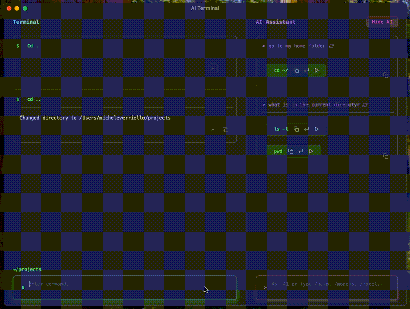

# AI Terminal

A Tauri + Angular terminal application with integrated AI capabilities.
 
## Features

- Natural language command interpretation
- Integrated AI assistant
- Command history and auto-completion
- Cross-platform support (macOS, Windows, Linux)
- Modern UI built with Tauri and Angular

## Requirements

- Node.js 18+
- Rust and Cargo
- For AI features: [Ollama](https://ollama.ai/) (can be installed with `brew install ollama`)

## Development Setup

1. Clone the repository:
   ```
   git clone https://github.com/your-username/ai-terminal.git
   cd ai-terminal
   ```

2. Install dependencies and run the project:
   ```
   cd ai-terminal
   npm install
   npm run tauri dev
   ```

## Installation

### macOS (Homebrew)

You can install AI Terminal using Homebrew:

```bash
brew tap AiTerminalFoundation/ai-terminal
brew install --cask ai-terminal
```

After installation, you can launch the application from Spotlight or run it from the terminal:

```bash
ai-terminal
```

## Quick Guide to Using Ollama to Download `macsdeve/BetterBash3` Model

### Linux

1. **Install Ollama**

Open your terminal and run:

```bash
curl -fsSL https://ollama.com/install.sh | sh
```

2. **Download the Model**

Run the following command:

```bash
ollama pull macsdeve/BetterBash3
```

### macOS

1. **Download Ollama**

- Visit [Ollama download page](https://ollama.com/download/mac).
- Click **Download for macOS**.

2. **Install Ollama**

- Open the downloaded `.zip` file from your `Downloads` folder.
- Drag the `Ollama.app` into your `Applications` folder.
- Open `Ollama.app` and follow any prompts.

3. **Download the Model**

Open Terminal and execute:

```bash
ollama pull macsdeve/BetterBash3
```

## Contributing

Contributions are welcome! Please feel free to submit a Pull Request.

## License

[MIT License](LICENSE)
